# BIRDEYE API

## DỮ LIỆU GIAO DỊCH (TRANSACTION DATA - TXS)

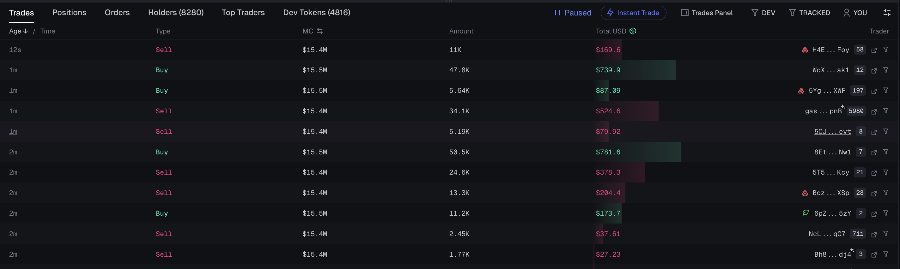

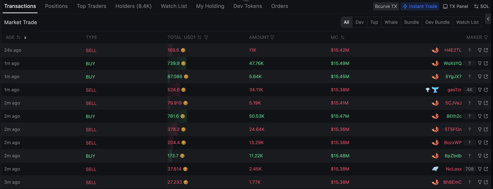

### 1. Thông tin cần có (Required Information)

| Field                  | Description                                                   |
| ---------------------- | ------------------------------------------------------------- |
| **time**               | Thời gian giao dịch (Unix Timestamp: blockUnixTime)           |
| **type**               | Loại giao dịch (Swap/Buy/Sell/Add Liquidity/Remove Liquidity) |
| **amount_token_base**  | Lượng Token Base trong giao dịch                              |
| **amount_token_quote** | Lượng Token Quote trong giao dịch                             |
| **price_usd**          | Giá trị USD của giao dịch (hoặc giá/đơn vị)                   |
| **wallet_address**     | Địa chỉ ví thực hiện giao dịch (owner)                        |

### 2. API cung cấp

#### 2.1. Lấy Txs theo Token (Trades - Token)

**Docs**: https://docs.birdeye.so/reference/get-defi-txs-token  
**Endpoint**: `https://public-api.birdeye.so/defi/txs/token`

**Input**:

- `address` (Required): Địa chỉ token
- `limit` (Optional): Số giao dịch tối đa (default: 50, max: 100)
- `offset` (Optional): Vị trí bắt đầu
- `tx_type` (Optional): swap, add, remove, all
- `sort_type` (Optional): asc, desc

**Output**:

```json
{
	"quote": {
		"symbol": "SOL",
		"decimals": 9,
		"address": "So11111111111111111111111111111111111111112",
		"amount": "968456086",
		"uiAmount": 0.968456086,
		"price": 192.3694410802793,
		"nearestPrice": 192.3694410802793,
		"changeAmount": 968456086,
		"uiChangeAmount": 0.968456086,
		"isScaledUiToken": false,
		"multiplier": null
	},
	"base": {
		"symbol": "1",
		"decimals": 6,
		"address": "GMvCfcZg8YvkkQmwDaAzCtHDrrEtgE74nQpQ7xNabonk",
		"amount": "11092528538",
		"uiAmount": 11092.528538,
		"price": 0.016876520547368153,
		"nearestPrice": 0.016876520547368153,
		"changeAmount": -11092528538,
		"uiChangeAmount": -11092.528538,
		"isScaledUiToken": false,
		"multiplier": null
	},
	"basePrice": 0.016876520547368153,
	"quotePrice": 192.3694410802793,
	"txHash": "2XmP7LB46irkdfrwkG1FU9Wt5uQznUfSrZKKyFJaEJDvZq1MkyjLDgFUtzy32f9bzACqVUhx512y2LpeDc4nJ7mY",
	"source": "meteora_dlmm",
	"blockUnixTime": 1761271892,
	"txType": "swap",
	"owner": "8aMJnEqkL1g8Xt6gAFAnW126affJcivEhDLCPw46Rkz7",
	"side": "sell",
	"alias": null,
	"pricePair": 0.00008730706282903231,
	"from": {
		"symbol": "1",
		"decimals": 6,
		"address": "GMvCfcZg8YvkkQmwDaAzCtHDrrEtgE74nQpQ7xNabonk",
		"amount": "11092528538",
		"uiAmount": 11092.528538,
		"price": 0.016876520547368153,
		"nearestPrice": 0.016876520547368153,
		"changeAmount": -11092528538,
		"uiChangeAmount": -11092.528538,
		"isScaledUiToken": false,
		"multiplier": null
	},
	"to": {
		"symbol": "SOL",
		"decimals": 9,
		"address": "So11111111111111111111111111111111111111112",
		"amount": "968456086",
		"uiAmount": 0.968456086,
		"price": 192.3694410802793,
		"nearestPrice": 192.3694410802793,
		"changeAmount": 968456086,
		"uiChangeAmount": 0.968456086,
		"isScaledUiToken": false,
		"multiplier": null
	},
	"tokenPrice": 0.016876520547368153,
	"poolId": "Gi3959wDyHbQfs612ztsh3GWw8LYHhW4fx5YSJzbihy6"
}
```

-> Đủ thông tin

#### 2.2. Lấy Txs theo Pair

**Docs**: [https://docs.birdeye.so/reference/get-defi-txs-pair](https://docs.birdeye.so/reference/get-defi-txs-pair)  
**Endpoint**: `https://public-api.birdeye.so/defi/txs/pair`

**Input**:

- `address`: Pair address
- `limit`, `offset`, `tx_type`, `sort_type`

**Output**:

```json
{
  "txHash": "59g6gnaqFocqmuMtpEiYc1uu9DqeTkxgddfhH57UJyB5rhkZvGhxWoLMWg5tSn6gYA36HvZYpZ3SizeGNKLEpYMM",
  "source": "raydium_cp",
  "blockUnixTime": 1761271562,
  "txType": "swap",
  "address": "6sEkZ73vph5AFYmQTzaV6H5vAQQLZ2C8WqeCQ6MhLqFk",
  "owner": "FkskH3gNDpt4j4UPVCV9pU7PaterGHezfsoFixzhuvuv",
  "from": {
    "symbol": "USD1",
    "decimals": 6,
    "address": "USD1ttGY1N17NEEHLmELoaybftRBUSErhqYiQzvEmuB",
    "amount": 21288695,
    "type": "transferChecked",
    "typeSwap": "from",
    "uiAmount": 21.288695,
    "price": 0.9994913999482231,
    "nearestPrice": 0.9994913999482231,
    "changeAmount": -21288695,
    "uiChangeAmount": -21.288695,
    "isScaledUiToken": false,
    "multiplier": null
  },
  "to": {
    "symbol": "1",
    "decimals": 6,
    "address": "GMvCfcZg8YvkkQmwDaAzCtHDrrEtgE74nQpQ7xNabonk",
    "amount": 1247538303,
    "type": "transferChecked",
    "typeSwap": "to",
    "uiAmount": 1247.538303,
    "price": 0.01705588318807774,
    "nearestPrice": 0.017019533717841255,
    "changeAmount": 1247538303,
    "uiChangeAmount": 1247.538303,
    "isScaledUiToken": false,
    "multiplier": null
  }
},
```

-> Đủ thông tin

#### 2.3. WebSocket - Real-time Transactions

**Protocol**: `SUBSCRIBE_TXS`

| Aspect       | Details                                                                       |
| ------------ | ----------------------------------------------------------------------------- |
| **Output**   | Real-time: blockUnixTime, side, baseAmount, quoteAmount, owner, value, txHash |
| **Đánh giá** | ✅ **100% Coverage**                                                          |

---

## POSITIONS

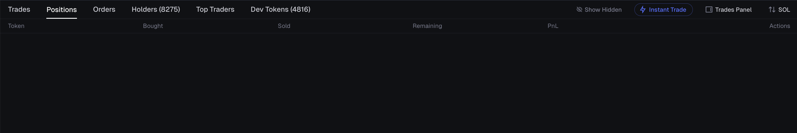

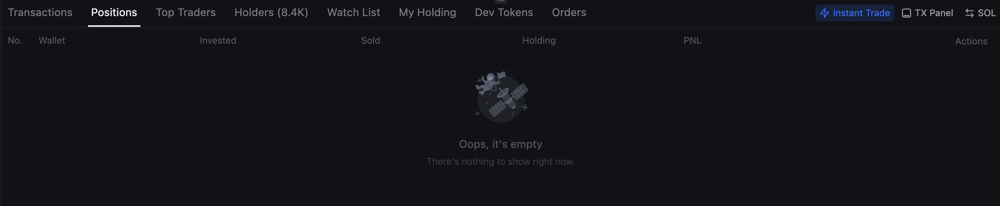

### 1. Thông tin cần có (Required Information)

| Field             | Description                 |
| ----------------- | --------------------------- |
| **token_address** | Địa chỉ contract của token  |
| **token**         | Tên/ký hiệu token           |
| **bought**        | Tổng lượng/giá trị đã mua   |
| **sold**          | Tổng lượng/giá trị đã bán   |
| **remaining**     | Lượng token còn lại         |
| **pnl**           | Lợi/lỗ chưa thực hiện (USD) |

### 2. API cung cấp

#### 2.1 Lấy Balance Changes theo Wallet

**Docs**: https://docs.birdeye.so/reference/get-wallet-v2-balance-change  
**Endpoint**: `https://public-api.birdeye.so/wallet/v2/balance_change`

**Input**:

- `address` (Required): Địa chỉ ví
- `token_address` (Optional): Địa chỉ token để filter
- `time_from` (Optional): Unix timestamp bắt đầu
- `time_to` (Optional): Unix timestamp kết thúc
- `type` (Optional): SOL, SPL
- `change_type` (Optional): increase, decrease
- `limit` (Optional): Số record tối đa (default: 20, max: 100)
- `offset` (Optional): Vị trí bắt đầu (max: 10000)

**Output**:

```json
{
	"time": "2025-09-24T21:18:40Z",
	"block_number": 369029608,
	"block_unix_time": 1758748720,
	"address": "G9J6vKowvpnZUEEQr2DAjqdKUvZW8ceoTzv6QrMZYP22",
	"token_account": "3uHbSLrdNoqg32zeYW1BVDBBjDVfP7VYsrdUSrZT4Bvy",
	"tx_hash": "2kbJcP6S4rvyTFQn7vVwt4rzQTTYhAyvxGw2etmftrcky8YynDGRzGsA4ntQzHrHSuvk2qNeoTx2cs8Moe6mt7cf",
	"pre_balance": "100000000000",
	"post_balance": "0",
	"amount": "-100000000000",
	"token_info": {
		"address": "GMvCfcZg8YvkkQmwDaAzCtHDrrEtgE74nQpQ7xNabonk",
		"decimals": 6,
		"symbol": "1",
		"name": "1 coin can change your life",
		"logo_uri": "https://wsrv.nl/?w=128&h=128&default=1&url=https://ipfs.io/ipfs/bafkreieuq6tf4rlyrwsn6t5kls47upegkmyhdobgoiq7i7u3yemws2znpm",
		"is_scaled_ui_token": false,
		"multiplier": null
	},
	"type": 2,
	"type_text": "SPL",
	"change_type": 2,
	"change_type_text": "DECR" // "INCR" | "DECR"
}
```

**Use case**: Hiển thị lịch sử thay đổi balance theo thời gian (timeline/history view) filter theo token

#### 2.2 Lấy PnL chi tiết theo Token

**Docs**: https://docs.birdeye.so/reference/get-wallet-v2-pnl  
**Endpoint**: `https://public-api.birdeye.so/wallet/v2/pnl`

**Input**:

- `wallet` (Required): Địa chỉ ví
- `token_addresses` (Required): Danh sách địa chỉ token (max 50 tokens)

**Output**:

```json
{
	"success": true,
	"data": {
		"meta": {
			"address": "63A99xoxxUVBm8VUguBcJZbYWDLi9AjYvYtB16xWqCzw",
			"currency": "usd",
			"holding_check": false,
			"time": "2025-10-24T02:44:13.069888109Z"
		},
		"tokens": {
			"GMvCfcZg8YvkkQmwDaAzCtHDrrEtgE74nQpQ7xNabonk": {
				"symbol": "1",
				"decimals": 6,
				"counts": {
					"total_buy": 54,
					"total_sell": 15,
					"total_trade": 69
				},
				"quantity": {
					"total_bought_amount": 30604776.570908006,
					"total_sold_amount": 769580,
					"holding": 33344768.936466
				},
				"cashflow_usd": {
					"cost_of_quantity_sold": 4265.126083000671,
					"total_invested": 169616.1943098672,
					"total_sold": 5808.076570873827,
					"current_value": 570646.749963034
				},
				"pnl": {
					"realized_profit_usd": 1542.9504878731557,
					"realized_profit_percent": 36.17596427038409,
					"unrealized_usd": 345234.50488465966,
					"unrealized_percent": 208.78879621810958,
					"total_usd": 346777.45537253283,
					"total_percent": 204.4483174401464,
					"avg_profit_per_trade_usd": 28.573157182836216
				},
				"pricing": {
					"current_price": 0.017113531392294996,
					"avg_buy_cost": 0.0055421477728120165,
					"avg_sell_cost": 0.00754707317091638
				}
			}
		}
	}
}
```

**Giải thích**:

- **token_address**: Key trong `tokens` object (`GMvCfcZg8YvkkQmwDaAzCtHDrrEtgE74nQpQ7xNabonk`)
- **token**: `symbol` ("1")
- **bought**: `quantity.total_bought_amount` (30,604,776.57 tokens)
- **sold**: `quantity.total_sold_amount` (769,580 tokens)
- **remaining**: `quantity.holding` (33,344,768.94 tokens)
- **pnl**: `pnl.unrealized_usd` ($345,234.50) hoặc `pnl.total_usd` ($346,777.46 bao gồm realized)

-> Cung cấp TẤT CẢ thông tin positions đã được tính toán

**Bonus fields** (có thêm nhiều thông tin hữu ích):

- `counts.total_buy/total_sell`: Số lượng giao dịch mua/bán
- `cashflow_usd.total_invested`: Tổng USD đã đầu tư
- `cashflow_usd.current_value`: Giá trị hiện tại
- `pnl.realized_profit_usd`: Lợi nhuận đã chốt
- `pricing.avg_buy_cost`: Giá mua trung bình
- `pricing.current_price`: Giá hiện tại

---

## ORDERS

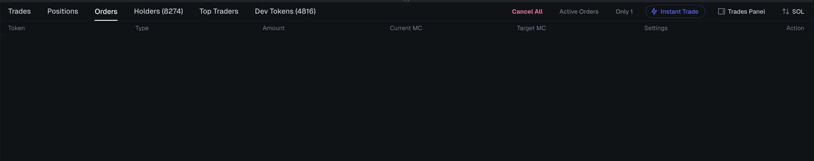

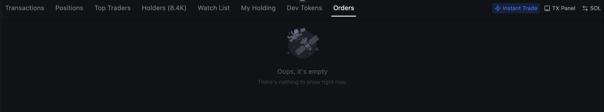

### 1. Thông tin cần có (Required Information)

| Field                 | Description                          |
| --------------------- | ------------------------------------ |
| **type**              | Loại lệnh (MARKET/LIMIT/STOP_LOSS)   |
| **token**             | Tên/ký hiệu token                    |
| **amount**            | Lượng token                          |
| **current_marketcap** | Market cap hiện tại                  |
| **target_marketcap**  | Market cap mục tiêu để execute order |

### 2. Đánh giá

**Birdeye API không cung cấp endpoint cho Orders/Limit Orders**

Birdeye chủ yếu tập trung vào:

- ✅ Lịch sử giao dịch (đã thực hiện)
- ✅ Dữ liệu token & giá
- ✅ Số dư ví & PnL
- ❌ **Pending orders/Limit orders** (KHÔNG có)

Orders/Limit orders được quản lý bởi các **DEX Aggregators**

### 3. Giải pháp thay thế

- Jupiter Limit Order API: https://station.jup.ag/docs/limit-order/limit-order-api
- Jupiter Order Book

---

## HOLDERS

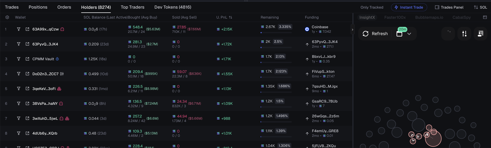

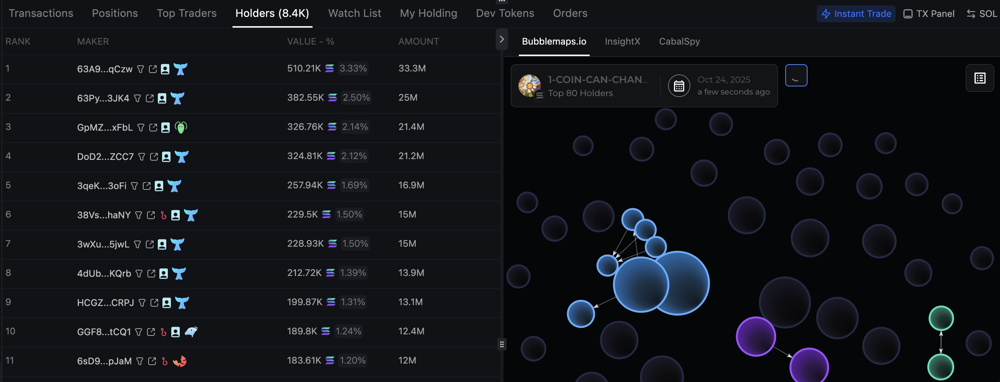

### 1. Thông tin cần có (Required Information)

| Field                  | Description           |
| ---------------------- | --------------------- |
| **wallet**             | Địa chỉ ví            |
| **token_balance**      | Lượng token nắm giữ   |
| **usd_balance**        | Giá trị USD           |
| **holding_percentage** | Phần trăm nắm giữ (%) |
| **bought**             | Tổng mua              |
| **sold**               | Tổng bán              |
| **unrealized_pnl**     | Lợi/lỗ chưa thực hiện |

### 2. API cung cấp

**Docs**: https://docs.birdeye.so/reference/get-defi-v3-token-holder  
**Endpoint**: `https://public-api.birdeye.so/defi/v3/token/holder`

**Input**:

- `address` (Required): Địa chỉ token contract
- `offset` (Optional): Vị trí bắt đầu (default: 0, max: 10000)
- `limit` (Optional): Số record tối đa (default: 100, max: 100)
- Note: `offset + limit <= 10000`

**Output**:

```json
{
	"success": true,
	"data": {
		"items": [
			{
				"amount": "33344768936466",
				"decimals": 6,
				"mint": "GMvCfcZg8YvkkQmwDaAzCtHDrrEtgE74nQpQ7xNabonk",
				"owner": "63A99xoxxUVBm8VUguBcJZbYWDLi9AjYvYtB16xWqCzw",
				"token_account": "4XH3aLq4Ck2NAtT3Y9LUd3mkmWtzqmjw5E16rJqCp1ZH",
				"ui_amount": 33344768.936466,
				"is_scaled_ui_token": false,
				"multiplier": null
			},
			{
				"amount": "25001354828959",
				"decimals": 6,
				"mint": "GMvCfcZg8YvkkQmwDaAzCtHDrrEtgE74nQpQ7xNabonk",
				"owner": "63PyvQ4vukystmGPKH1J5C62TuEarwBVjzgtuvJw3JK4",
				"token_account": "Hb4XqaHK5eXVM63F7cDRiMwQ29Tw1sLtdYVtma5bnbgi",
				"ui_amount": 25001354.828959,
				"is_scaled_ui_token": false,
				"multiplier": null
			}
		]
	}
}
```

**Giải thích**:

- **wallet**: `owner` (địa chỉ ví holder)
- **token_balance**: `ui_amount` (số lượng token đã normalize với decimals)
- **token_address**: `mint` (địa chỉ token contract)

API này chỉ trả về **basic holder data**:

- ✅ Có: wallet address, token balance
- ❌ Không có: USD value, holding %, bought/sold amounts, PnL
- Dữ liệu giống bên mevx.io, 2 bên còn lại hiển thị các địa chỉ holder giống nhưng không hiện phần số lượng dang hold nên em không chắc

**Method**: Get basic holder list

**API Calls Needed**:

1. `/defi/v3/token/holder` - Get holder list
2. `/defi/price` - Get current price (for USD value)
3. `/defi/v3/token/market-data` - Get total supply (for holding %)
4. `/wallet/v2/pnl` - Get PnL per holder (if needed, but requires calling per wallet)

## TOP TRADERS

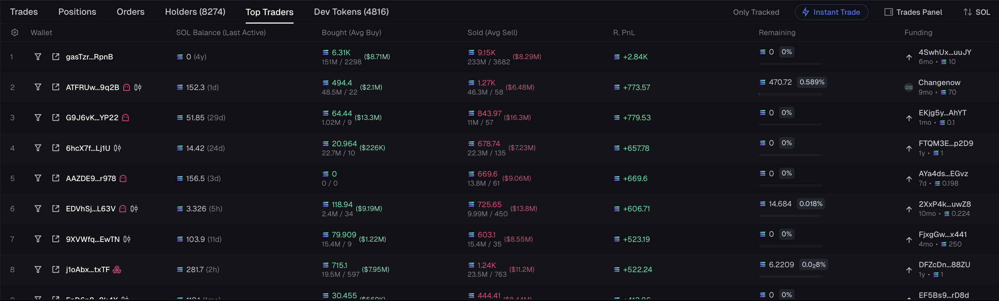

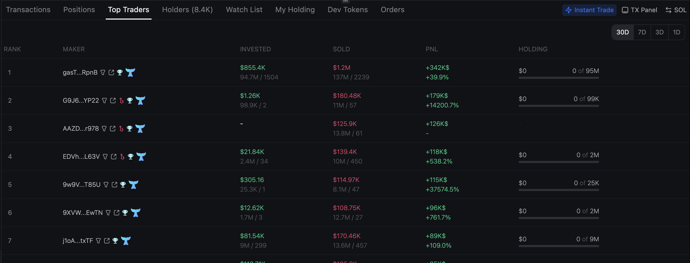

### 1. Thông tin cần có (Required Information)

| Field              | Description               |
| ------------------ | ------------------------- |
| **wallet_address** | Địa chỉ ví trader         |
| **bought**         | Tổng mua trong time frame |
| **sold**           | Tổng bán trong time frame |
| **remaining**      | Lượng token còn           |
| **pnl**            | Lợi/lỗ                    |
| **funding**        |                           |

### 2. API cung cấp

**Docs**: https://docs.birdeye.so/reference/get-defi-v2-tokens-top_traders  
**Endpoint**: `https://public-api.birdeye.so/defi/v2/tokens/top_traders`

**Input**:

- `address` (Required): Địa chỉ token contract
- `time_frame` (Required): Khung thời gian (30m, 1h, 2h, 4h, 6h, 8h, 12h, 24h)
- `sort_by` (Optional): Sắp xếp theo volume hoặc trade (default: volume)
- `sort_type` (Optional): asc hoặc desc (default: desc)
- `offset` (Optional): Vị trí bắt đầu (default: 0, max: 10000)
- `limit` (Optional): Số record tối đa (default: 10, max: 10)
- Note: `offset + limit <= 10000`

**Output**:

```json
{
	"success": true,
	"data": {
		"items": [
			{
				"tokenAddress": "GMvCfcZg8YvkkQmwDaAzCtHDrrEtgE74nQpQ7xNabonk",
				"owner": "CCVZm1VzQb4nAcskBDe8kJbf2a5nMjpoxXMepmgqWuos",
				"tags": [],
				"type": "24h",
				"volume": 5217336.080840999,
				"trade": 58,
				"tradeBuy": 14,
				"tradeSell": 44,
				"volumeBuy": 1575417.5323599996,
				"volumeSell": 3641918.548481,
				"isScaledUiToken": false,
				"multiplier": null
			},
			{
				"tokenAddress": "GMvCfcZg8YvkkQmwDaAzCtHDrrEtgE74nQpQ7xNabonk",
				"owner": "AgmLJBMDCqWynYnQiPCuj9ewsNNsBJXyzoUhD9LJzN51",
				"tags": [],
				"type": "24h",
				"volume": 4751868.249796087,
				"trade": 182,
				"tradeBuy": 93,
				"tradeSell": 89,
				"volumeBuy": 2615733.8972230577,
				"volumeSell": 2136134.3525730297,
				"isScaledUiToken": false,
				"multiplier": null
			}
		]
	}
}
```

**Giải thích**:

- **wallet_address**: `owner` (địa chỉ ví trader)
- **bought**: `volumeBuy` - tổng volume mua trong timeframe (ví dụ output: ~$1.57M trong 24h)
- **sold**: `volumeSell` - tổng volume bán trong timeframe (ví dụ output: ~$3.64M trong 24h)
- **trade counts**: `tradeBuy` và `tradeSell` (số lượng giao dịch trong timeframe)
- **type**: Timeframe của data (ví dụ: "24h")

**⚠️ Lưu ý quan trọng**:

1. **Timeframe-based**: Data chỉ trong khoảng thời gian được chọn (30m/1h/2h/4h/6h/8h/12h/24h), **KHÔNG phải** toàn bộ lịch sử
2. **Volume unit**: Documentation không nói rõ, nhưng dựa vào giá trị và các API khác của Birdeye, có vẻ là USD value

| Field          | API Source                    | Cách lấy                                              |
| -------------- | ----------------------------- | ----------------------------------------------------- |
| wallet_address | `/defi/v2/tokens/top_traders` | Lấy trực tiếp từ owner                                |
| bought         | `/defi/v2/tokens/top_traders` | Lấy trực tiếp từ volumeBuy (USD value)                |
| sold           | `/defi/v2/tokens/top_traders` | Lấy trực tiếp từ volumeSell (USD value)               |
| remaining      | ❌ Không có                   | Cần gọi `/defi/v3/token/holder` hoặc `/wallet/v2/pnl` |
| pnl            | ❌ Không có                   | Cần gọi `/wallet/v2/pnl` cho từng trader              |
| funding        | ❌ Không có                   | Birdeye không cung cấp                                |

**Recommendation**:

- ✅ Dùng API này cho: Top traders ranking theo trading volume trong timeframe cụ thể
- ⚠️ Limitation 1: Volume chỉ trong timeframe đã chọn (30m-24h), không phải tổng toàn bộ
- ⚠️ Limitation 2: Volume có vẻ tính theo USD, không phải token amount
- ❌ Cần thêm API calls: Để lấy remaining balance và PnL của từng trader

---

## DEV TOKENS

**Các token cùng được deploy bởi địa chỉ ví dev này**

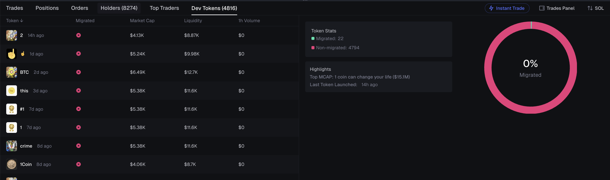

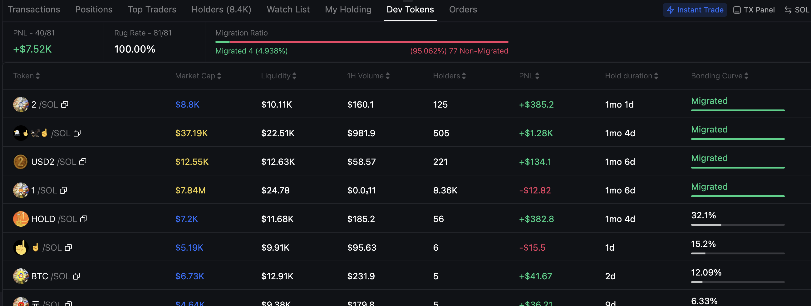

### 1. Thông tin cần có (Required Information)

| Field          | Description                      |
| -------------- | -------------------------------- |
| **token**      | Tên/ký hiệu token                |
| **migrated**   | Có migrate contract hay không    |
| **market_cap** | Vốn hóa thị trường hiện tại      |
| **liquidity**  | Tổng liquidity trong pool (USD)  |
| **volume_1h**  | Khối lượng giao dịch 1 giờ (USD) |

### 2. Đánh giá

**❌ Birdeye API KHÔNG hỗ trợ tính năng này**

Birdeye có API để:

- ✅ Token → Creator: `/defi/token_creation_info` (input: token address → output: creator address)
- ✅ Wallet → Tokens held: `/v1/wallet/token_list` (tokens mà wallet đang nắm giữ)
- ❌ **Creator → Tokens**: KHÔNG có API để lấy danh sách tokens được tạo bởi một creator address

**Giải pháp**:

- Không dùng Birdeye cho Dev Tokens feature
- Dùng Helius hoặc Solana RPC để lấy tokens by creator
- Sau đó dùng Birdeye để enrich market data (price, MC, liquidity, volume)

---

## TỔNG KẾT & ĐÁNH GIÁ

| Feature         | Độ phủ  | API có sẵn | Độ phức tạp | Đánh giá & Khuyến nghị                                   |
| --------------- | ------- | ---------- | ----------- | -------------------------------------------------------- |
| **TXS**         | ✅ 85%  | Có         | Thấp        | ✅ **Highly recommended** - API hoàn chỉnh, dễ dùng      |
| **POSITIONS**   | ✅ 100% | Có         | Thấp        | ✅ **Perfect** - API `/wallet/v2/pnl` cung cấp mọi thứ   |
| **ORDERS**      | ❌ 0%   | Không      | -           | ❌ **Not supported** - Dùng Jupiter API thay thế         |
| **HOLDERS**     | ⚠️ 30%  | Một phần   | Cao         | ⚠️ **Limited** - Chỉ có danh sách cơ bản, thiếu PnL data |
| **TOP TRADERS** | ⚠️ 60%  | Một phần   | Trung bình  | ⚠️ **Good for ranking** - Timeframe-based, thiếu PnL     |
| **DEV TOKENS**  | ❌ 0%   | Không      | -           | ❌ **Not supported** - Dùng Helius/Solana RPC            |

### Kết luận

**Birdeye support:**

- ✅ **TXS** và **POSITIONS** - 2 features mạnh nhất, highly recommended
- ✅ **TOP TRADERS** - Tốt cho leaderboard (chấp nhận limitation về timeframe)
- ⚠️ **HOLDERS** - Chỉ dùng cho danh sách cơ bản

**birdeye không support:**

- ❌ **ORDERS** - Dùng Jupiter API thay thế
- ❌ **DEV TOKENS** - Dùng Helius/Solana RPC, sau đó enrich market data bằng Birdeye

---
